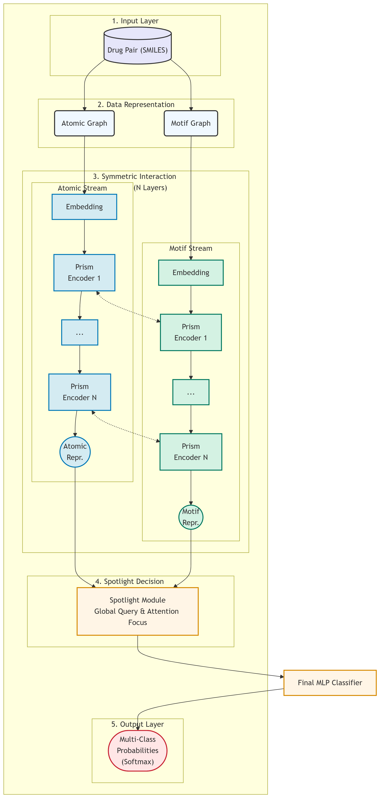

---

```markdown
# PRISM-DDI: Parallel Reasoning and Interaction Spotlight Model for DDI Prediction

[](https://www.python.org/downloads/)
[](https://www.tensorflow.org/)
[](https://opensource.org/licenses/MIT)

**PRISM-DDI** is a novel, State-of-the-Art framework for multi-class Drug-Drug Interaction (DDI) prediction. The name "PRISM" serves as both an acronym and a powerful metaphor: like a prism decomposing light into its constituent spectra, our model decomposes the complex phenomenon of DDI into distinct, complementary information streams—**atomic topology** and **functional motifs**—and ultimately focuses on the core interaction signals with a unique **Spotlight** mechanism.

Our model achieves **95.59% accuracy** on the ZhongDDI benchmark, surpassing the previous SOTA model.

This repository contains the official implementation of PRISM-DDI and the necessary scripts to reproduce our results.

## Core Idea & Architecture

The PRISM-DDI model is built upon three core principles designed to address key challenges in DDI prediction:

1.  **Symmetric Dual-Stream Architecture:** We model the inherent duality of chemical information through two parallel Transformer-based streams:
    *   **Atomic Stream:** Captures the fine-grained topological information from the atom-bond graph.
    *   **Motif Stream:** Captures the high-level functional semantics from the chemical motif graph.

2.  **Deep Layer-wise Interaction:** Unlike traditional models that fuse information late, PRISM-DDI enforces deep interaction at **every layer** of its encoders. A custom `PrismGATLayer` performs both intra-drug self-attention and inter-drug cross-attention, allowing the representations of the two drugs to co-evolve and mutually refine each other throughout the learning process.

3.  **Spotlight Decision Module:** For final prediction, the model forms a global context query representing the DDI task and uses it as a "spotlight" to attend to all functional motifs. This allows the model to dynamically focus on the most critical substructures for a given interaction, leading to both higher accuracy and enhanced interpretability.


*(Note: Please place your model architecture diagram at `results/figures/prism_architecture.png`)*

## Performance

PRISM-DDI sets a new state-of-the-art on the ZhongDDI multi-class benchmark dataset.

| Model       | Accuracy (%)      | AUROC (%)         | AUPR (%)          |
|-------------|-------------------|-------------------|-------------------|
| **PRISM-DDI (Ours)** | **95.59**         | **99.49**         | **98.73**         |

## Setup and Installation

This project is developed using Python 3.8 and TensorFlow 2.10+.

1.  **Clone the repository:**
    ```bash
    git clone https://github.com/harukafreeze/PRISM-DDI.git
    cd PRISM-DDI
    ```

2.  **Create a Conda environment (recommended):**
    ```bash
    conda create -n prism python=3.8
    conda activate prism
    ```

3.  **Install dependencies:**
    The necessary CUDA/cuDNN toolkit and TensorFlow will be installed via pip. Ensure your NVIDIA driver is compatible.
    ```bash
    pip install -r requirements.txt
    ```

## Reproducing Results

Follow these steps to reproduce our SOTA results.
```bash

#### 1. Data Preprocessing

*(Note: Provide instructions on how to obtain and preprocess the data. If the preprocessed file is provided, simplify this step.)*

First, download the raw dataset (e.g., ZhongDDI) and place the CSV files in the `data/raw/` directory. Then, run the preprocessing notebook to generate the feature file:

```bash
# Run the cells in notebooks/2_preprocess_dataset.ipynb
```
This will create the `precomputed_drug_features.npy` file in `data/processed/`.

#### 2. Training

To start the training process with the default optimal hyperparameters, run the main training script:

```bash
python scripts/train.py
```
The script will automatically use learning rate scheduling, early stopping, and save the best model weights to the `results/trained_models/` directory.

#### 3. Evaluation

Once training is complete, an evaluation on the test set will be performed automatically. To re-evaluate a saved model, use the evaluation script:

```bash
# Ensure the model path in the script is correct
python scripts/final_evaluate.py
```
This will print the full performance report, including Accuracy, AUROC, and AUPR.

## Running Ablation Studies

We provide a dedicated script to easily reproduce the ablation studies presented in our paper.

```bash
# Example: Run the "Motif-Only" ablation experiment
python scripts/ablation_runner.py --ablation_type motif_only

# Example: Run the "No Cross-Attention" experiment
python scripts/ablation_runner.py --ablation_type no_cross_attention
```

Available ablation types are: `motif_only`, `atomic_only`, `no_cross_attention`, and `no_spotlight`.

## Citation

If you find our work useful, please consider citing:

```
@article{,
  title={PRISM-DDI: Parallel Reasoning and Interaction Spotlight Model for DDI Prediction},
  author={},
  journal={},
  year={},
  pages={}
}
```

## License

This project is licensed under the MIT License. See the `LICENSE` file for details.
```
